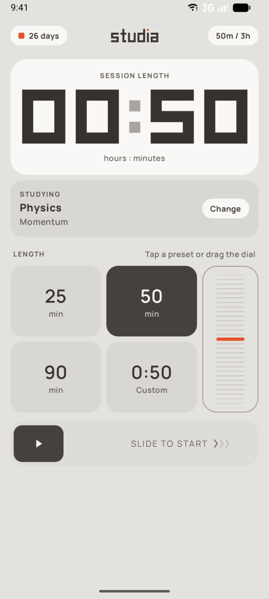
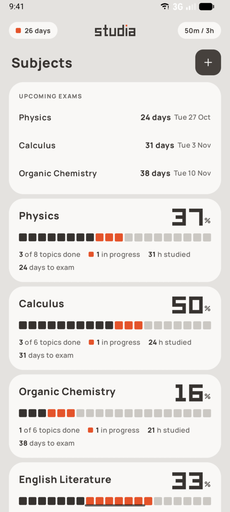
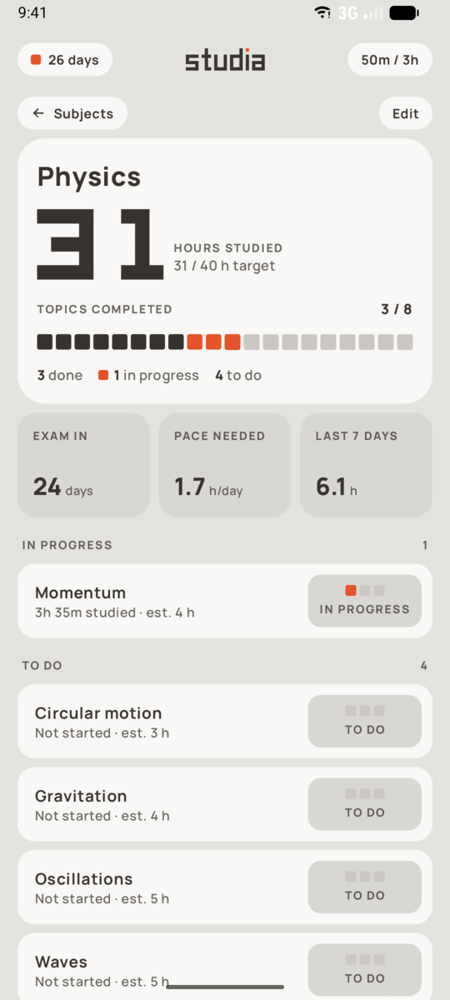
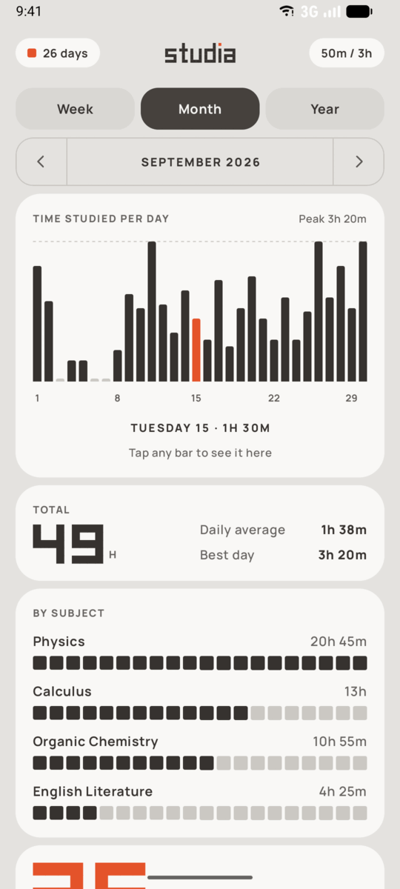
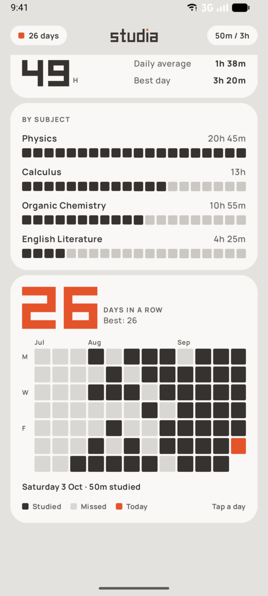
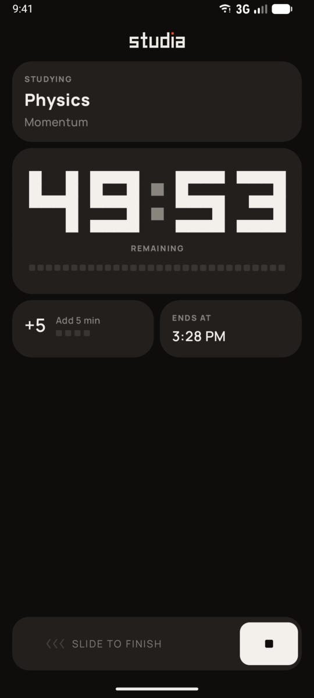
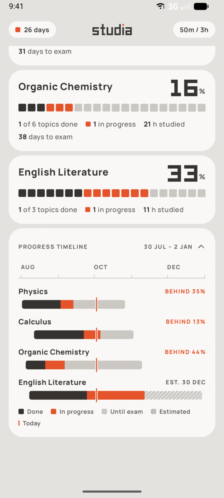
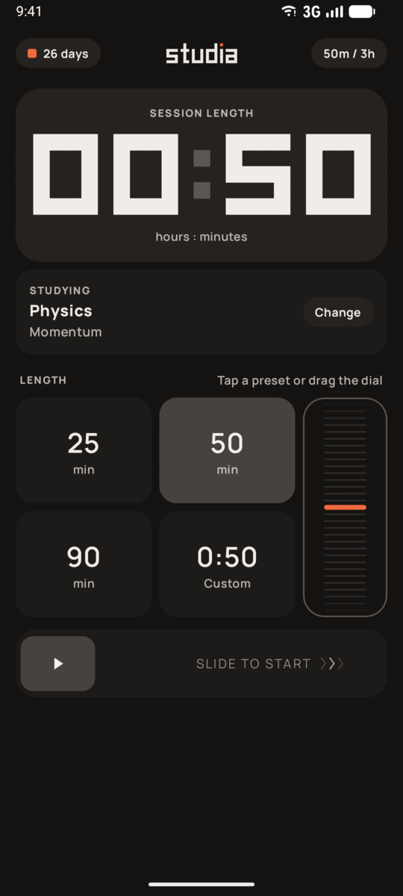
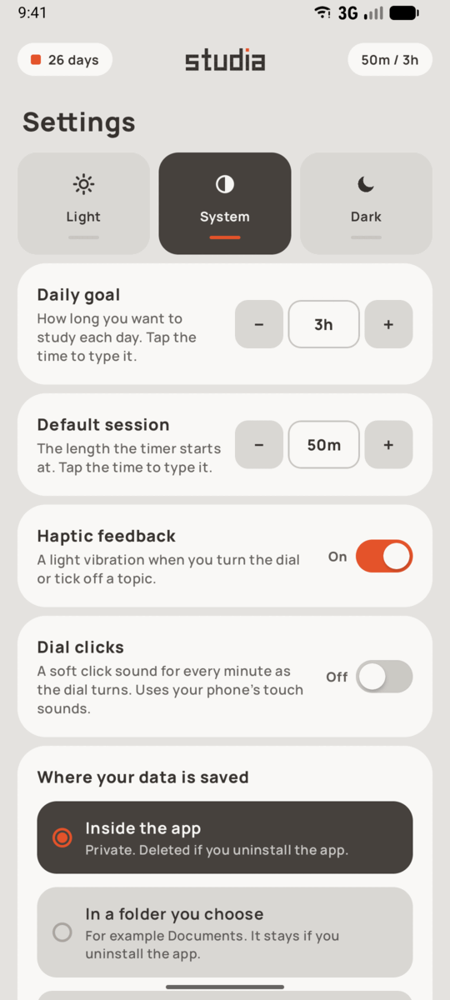

<p align="center">
  
</p>

<h1 align="center">Studia</h1>

<p align="center">
  A calm, tactile study tracker for Android.<br/>
  Plan subjects and topics, time focused sessions, and see your progress at a glance.
</p>

<p align="center">
  
  
  
  
</p>

<p align="center">
  <a href="https://github.com/wanikhawar/studia/releases/latest"><b>⬇ Download the latest APK</b></a>
</p>

<table>
  <tr>
    <td align="center"><br/><sub><b>Focus:</b> pick a length, slide to start</sub></td>
    <td align="center"><br/><sub><b>Subjects:</b> upcoming exams and progress</sub></td>
    <td align="center"><br/><sub><b>A subject:</b> hours, topics, pace needed</sub></td>
  </tr>
  <tr>
    <td align="center"><br/><sub><b>Stats:</b> time per day, week, month or year</sub></td>
    <td align="center"><br/><sub><b>Streak:</b> 12 weeks, tap any day</sub></td>
    <td align="center"><br/><sub><b>Session:</b> one countdown, slide to finish</sub></td>
  </tr>
  <tr>
    <td align="center"><br/><sub><b>Timeline:</b> every subject against its exam</sub></td>
    <td align="center"><br/><sub><b>Dark mode</b></sub></td>
    <td align="center"><br/><sub><b>Settings</b></sub></td>
  </tr>
</table>

## What it does

**Focus sessions**
- Choose 25, 50 or 90 minutes, type an exact length, or turn the dial, which coasts and clicks under your thumb.
- Slide to start. A single countdown fills the screen, with **+5 min** and the end time underneath. Slide to finish.
- A live countdown notification while the app is closed, and an on-time alert when the session ends.
- Only whole minutes you actually studied are logged. A false start under a minute is ignored, and short sessions can be discarded.

**Subjects and topics**
- Subjects with an optional exam date and hours target, each holding topics marked **To do**, **In progress** or **Done**.
- Every subject shows hours studied, topics completed, days to the exam and the **pace needed**: hours per day to finish in time at your current rate.
- **Upcoming exams** at the top, and a **progress timeline** of every subject against its exam, flagged *On track* or *Behind*.
- Paste a whole syllabus to add topics in one go. Edit or delete anything.

**Stats and streaks**
- Time studied per day, week, month or year, totals, and time per subject.
- A daily goal shown in the top bar ("55m / 3h") and a streak counter.
- A 12-week heatmap with weekday and month labels. Tap a day to see what you did.

**Your data**
- Everything stays on your phone. The app has no internet access and no accounts.
- Optionally keep a `studia.json` save file in a folder you choose, kept up to date after every change. Open it on another phone to carry your data over.
- Safe by design: files are checked before they can replace your data, a damaged save is kept and recovered from the last good copy, and loading sample data or clearing everything keeps a backup you can restore.

## Design

Studia's look is inspired by the BlockIt app: warm greys, soft rounded tiles, a single orange accent, and big blocky pixel numerals. The orange block always means *now*: the topic in progress, the dial's marker, today in the streak grid. Controls are tactile (a drum dial, slide-to-confirm, native haptics), secondary text meets the 4.5:1 contrast guideline in both themes, and tabs switch with a sideways swipe.

The original clickable design prototype lives in [`mockup/studia.html`](mockup/studia.html).

## Install

You need a phone running Android 8.0 or newer.

1. On your phone, open the [latest release](https://github.com/wanikhawar/studia/releases/latest) and download the `.apk` file under **Assets**.
2. Open the downloaded file. If Android asks, allow your browser or file manager to install unknown apps.
3. Tap **Install**.

To update, install the newer APK the same way. Your data is kept.

## Build from source

You need **Android Studio** (it ships with the JDK and Android SDK) and a phone or emulator running Android 8.0 or newer.

1. Clone the repository and open the folder in Android Studio. Let Gradle sync.
2. Choose an emulator, or plug in a phone with USB debugging on.
3. Press **Run ▶**.

From a terminal:

```sh
./gradlew :app:installDebug        # build and install on a connected device
./gradlew :app:testDebugUnitTest   # run the unit tests
./gradlew :app:assembleRelease     # build a release APK
```

Release builds are signed only if `STUDIA_STORE_FILE`, `STUDIA_STORE_PASSWORD` and `STUDIA_KEY_ALIAS` are set in your `~/.gradle/gradle.properties`. Without them the release APK is unsigned and won't install, so use the debug build instead.

If Gradle complains about your Java version, point `JAVA_HOME` at the JDK bundled with Android Studio (for example `/opt/android-studio/jbr` on Linux).

### Permissions

| Permission | Why |
|---|---|
| Notifications | Countdown while a session runs, and the alert when it ends |
| Exact alarms | So the "time's up" alert arrives on time rather than minutes late |
| Vibrate | Haptic ticks on the dial and confirmations |

## Project structure

```
app/src/main/java/com/khawar/studia/
├── MainActivity.kt          app entry point
├── AppViewModel.kt          every action the UI can take
├── SessionNotifier.kt       countdown notification and time's-up alarm
├── data/
│   ├── Model.kt             subjects, topics, sessions, settings
│   ├── Store.kt             saving, backups, recovery and save-file sync
│   ├── DataFile.kt          checks a file really is valid Studia data
│   ├── DocumentRemote.kt    a save file in a folder the user picked
│   ├── Calc.kt              streaks, pace, stats ranges, timeline maths
│   └── Sample.kt            example data for a fresh install
└── ui/
    ├── StudiaApp.kt         top bar, swipeable tabs, messages
    ├── screens/             Focus, Subjects, Stats, Settings, session, sheets
    ├── components/          pixel numerals, wordmark, dial, slider, haptics
    └── theme/Theme.kt       light and dark palettes, Manrope font

app/src/test/                unit tests: calculations, sync, data safety
```

Built with Kotlin, Jetpack Compose and Material 3, with kotlinx.serialization for storage.

## License

Studia is released under the [MIT License](LICENSE).

The bundled [Manrope](https://github.com/googlefonts/manrope) typeface is © The Manrope Project Authors, used under the [SIL Open Font License 1.1](licenses/Manrope-OFL.txt).
